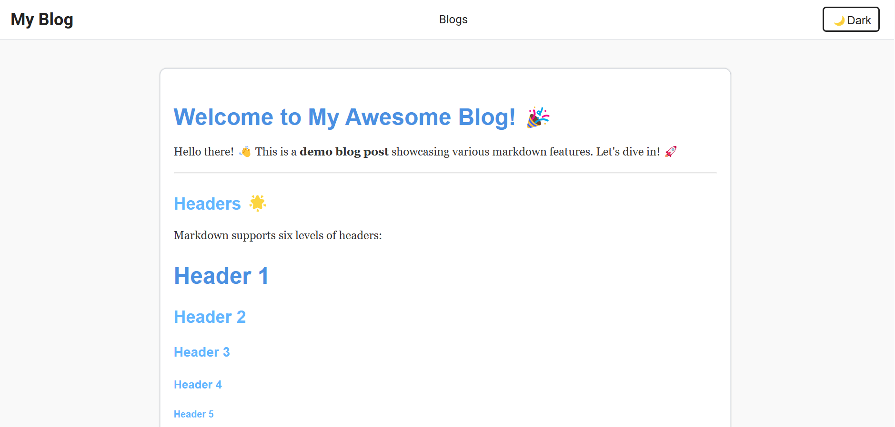
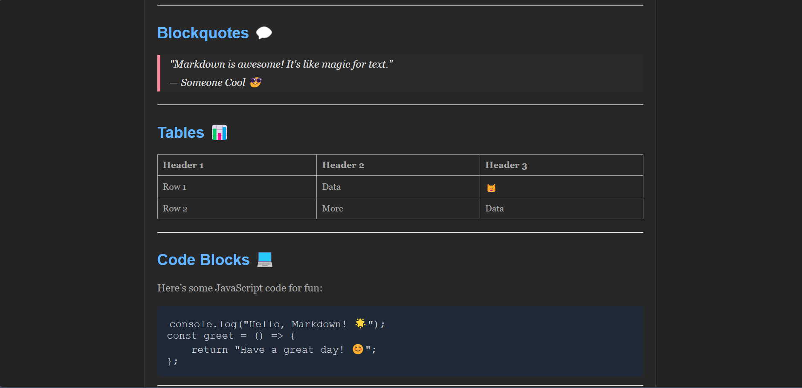

# MarkdownBlog

## 📖 About the Project
This project was created to serve as a light weight blogging platform ([and some other applications](#alternate-applications)) that seamlessly integrates with markdown files. By leveraging markdown for content and modern web technologies, this project aims to keep the blogging experience simple, fast, and customizable. (Just put your markdown into a folder and your blog is ready!)


### 🌟 Key Objectives
1. **Ease of Use**: Write blogs in markdown and render them effortlessly on the web.
2. **Customization**: Use your own styles and components to match your needs.
3. **Dynamic Rendering**: Support dynamic imports of images and assets from the project directory.

---

## ✨ Features

### ✅ Implemented Features
- Render markdown content into styled blog posts.
- Support for most of the markdown syntax including headings, lists, tables, blockquotes, and code blocks.
- Theme toggle (Light/Dark mode). 
- Responsive layout for blogs and images.
- Dynamically load internal images referenced in markdown.

### 🚧 Planned Features
- [ ] Add support for syntax highlighting in code blocks.
- [ ] Add page for handling all the blogs.
- [ ] Database support for storing details of blogs.
- [ ] Inbuilt markdown editor (maybe, not sure).
- [ ] Implement a search functionality to filter blogs.
- [ ] Create a category/tag/folder system for better organization.
- [ ] More themes and customization 

---

## 🛠️ Setup Instructions

### Prerequisites
Ensure you have the following installed:
- [Node.js](https://nodejs.org/) (LTS version recommended)
- npm (comes with Node.js) or yarn

### Steps
1. **Clone the repository**
   ```bash
   git clone https://github.com/ArchisKulkarni00/MarkdownBlog.git
   cd <repository-folder>
   ```

2. **Install dependencies**
   ```bash
   npm install
   ```
   or, if using yarn:
   ```bash
   yarn install
   ```

3. **Run the development server**
   ```bash
   npm start
   ```
   or, if using yarn:
   ```bash
   yarn start
   ```

4. **View the application**
   Open your browser and navigate to `http://localhost:3000` to see the blog.

5. **Add Markdown Files**
   - Store your markdown files in the `/src/articles` directory (currently fixed structure, may change).
   - Store images under `/src/images` directory
   - Add relative paths to images within the markdown file (eg `../images/sample.png`).

---

## 📸 Screenshots

_Add screenshots of the blog interface, dark/light themes, and markdown rendering here._

1. **Light Mode**:
   

2. **Dark Mode**:
   

---

## Alternate Applications🔄 <a id='alternate-applications'></a>

1. **Knowledge Base or Wiki**: Document workflows, FAQs, or team knowledge with searchable articles.  
2. **Recipe Book**: Store and share recipes with tags and filters for meal types or difficulty.  
3. **Academic Notes Repository**: Upload lecture notes or research papers with collaborative editing.  
4. **Portfolio Builder**: Showcase artworks, coding projects, or professional achievements.  
5. **Travel Journal**: Document trips with itineraries, photos, and maps.  
6. **User Manual/Documentation Platform**: Host user guides, API references, or troubleshooting steps.  
7. **Event Management/Announcement Board**: Share event updates, schedules, and photos.  
8. **Learning Platform for Tutorials**: Publish step-by-step guides with code highlighting and progress tracking.  
9. **Personal Productivity Dashboard**: Manage tasks, journaling, and projects in one place.  
10. **Multimedia Magazine**: Create a platform for stories, poems, and articles with dynamic layouts.  
11. **AI-Powered Research Assistant**: Use AI to summarize, highlight, and search markdown content.  

These ideas extend the project's functionality while retaining its core markdown-processing capabilities.

---

## 🧰 Tech Stack
- React.js
- CSS Modules
- Markdown Parsing: `react-markdown`
- Webpack for bundling

---

## 🤝 Contributing
Contributions, issues, and feature requests are welcome! Feel free to check out the [issues page](./issues) or submit a pull request.

**Document written with GPT and 💖*

